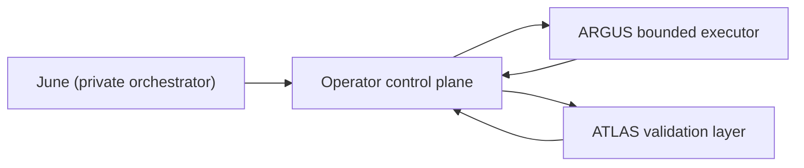

# operator-control-plane

[](LICENSE)
[](docs/README.md)
[](docs/STACK_SETUP.md)

Kurz auf Deutsch: `operator-control-plane` ist die zentrale Operator-Schicht des
Stacks. Sie haelt Projektwahrheit, Zustand, Research-Phasen, Evidenz und
Kontrollereignisse zusammen. ARGUS und ATLAS liefern begrenzte Ausfuehrungs-
und Validierungsergebnisse, aber Operator bleibt die Stelle, an der
Projektrealitaet entsteht.

`operator-control-plane` is the core state machine of the public stack.
It is not a thin router around tools. Operator owns project truth, research
state, evidence state, control-plane events, experiment-lane ingestion, and the
multi-phase research lifecycle that turns a question into a validated report.

## What Operator Actually Does

Operator runs long-lived research projects through explicit phases:

- `explore`: open the search space and gather initial evidence
- `focus`: narrow the search onto the strongest unresolved lines
- `connect`: cross-reference findings and build structure
- `verify`: run evidence gates, fact checks, and loop-back decisions
- `synthesize`: generate the report from the validated state

This is a stateful machine, not a one-shot prompt pipeline.
Operator keeps the canonical `project.json`, persists findings and metrics, and
decides whether a project advances, loops back, waits for another cycle, or
stops.

## Why This Repo Exists

The stack is intentionally split into bounded layers:

- `June` is the private global orchestrator
- `Operator` owns project truth and research state
- `ARGUS` performs bounded execution attempts
- `ATLAS` performs bounded validation and sandboxed checks

That separation is enforced on purpose:

- Operator is the only epistemic source of truth
- bounded workers may write bounded artifacts only
- UI and wrappers are clients of the control plane, not alternate planners
- project truth and mission truth must not silently diverge

If June and Operator disagree about project truth, Operator wins.

## What Is In This Repository

- shell-driven research workflows and phase transitions
- control-plane state machinery around `research/<project_id>/project.json`
- experiment-lane instantiation and ingestion contracts
- memory, brain, and support libraries
- a Next.js UI for inspecting and triggering Operator state
- backend, shell, integration, and UI tests

## System Shape



## Why It Is Different From A Typical Agent Repo

Most agent repositories optimize for a single loop.
Operator is built around ownership and durability:

- the research flow is phase-based rather than prompt-chain based
- evidence gates can block synthesis and force deeper work
- validation is explicit instead of implied
- experiments are subordinate to project truth, not a competing lane
- the UI reflects durable state instead of only transient runs

## Models And Retrieval Stack

The system does not force a single model across the whole research loop.
Different parts of the pipeline are routed through different model lanes based
on cost, depth, and verification needs.

### Model usage

- verification lanes route across `gemini-3.1-pro-preview`,
  `gemini-2.5-flash`, and `gpt-4.1-mini`
- synthesis and critique use stronger reasoning lanes such as `gpt-5.4`, with
  cheaper fallbacks when appropriate
- reasoning and extraction paths default to lighter models such as
  `gpt-4.1-mini`
- cross-project memory indexing uses `text-embedding-3-small`

This is implemented in the research toolchain rather than only described in
docs, so spend and model usage are tied to actual project state.

### Research sources

Operator combines multiple source classes instead of depending on a single web
search endpoint:

- web search via Brave Search or Serper
- academic literature via Semantic Scholar and arXiv
- biomedical literature via PubMed
- structured company evidence via SEC EDGAR
- page retrieval via direct fetch, Jina Reader, Google cache fallback,
  Wayback fallback, and PDF extraction

The goal is to keep research state durable while still pulling from a broad
enough source surface to support multi-phase evidence gathering and verification.

## Cost Profile

The stack tracks spend at the project level across:

- LLM usage
- search API usage
- embedding calls

Smaller runs often land in the tens of cents, while deeper multi-phase runs
cost more depending on search breadth, model lane selection, and validation
depth.

In my own runs, a typical lightweight cycle often lands around `$0.35`, but the
system does not pretend that this is a fixed number. Spend is tracked per
project and bounded through explicit budget checks.

## Reading Order

- [docs/README.md](docs/README.md)
- [docs/ARCHITECTURE.md](docs/ARCHITECTURE.md)
- [docs/CONTROL_PLANE_SPEC.md](docs/CONTROL_PLANE_SPEC.md)
- [docs/EXPERIMENT_LANE_CONTRACT.md](docs/EXPERIMENT_LANE_CONTRACT.md)
- [docs/STACK_SETUP.md](docs/STACK_SETUP.md)

## Repository Layout

- `workflows/`: research-cycle entrypoints and phase execution
- `tools/`: contracts, ingestion, state helpers, and research tooling
- `lib/`: memory, brain, and supporting libraries
- `ui/`: Next.js dashboard and API routes
- `docs/`: architecture, setup, and contract documents
- `tests/`: Python, shell, integration, and UI coverage

## Quickstart

### Backend

```bash
python3 -m venv .venv
source .venv/bin/activate
pip install -r requirements-research.txt -r requirements-test.txt
```

### UI

```bash
cd ui
npm install
cp .env.local.example .env.local
```

Set these values before logging in:

- `OPERATOR_ROOT`
- `UI_PASSWORD_HASH`
- `UI_SESSION_SECRET`

## Validation

```bash
python3 -m py_compile tools/*.py
./.venv/bin/pytest -q
cd ui && npm test
```

If `pnpm` is available, `pnpm test` from `ui/` is equivalent to the repo-local
Vitest command above.

## Related Repositories

This repo is the control-plane and truth layer of the public stack.
It is strongest when used with the bounded execution and validation layers:

- [argus-bounded-executor](https://github.com/Mickdownunder/argus-bounded-executor)
- [atlas-validation-layer](https://github.com/Mickdownunder/atlas-validation-layer)

For multi-repo wiring, see [docs/STACK_SETUP.md](docs/STACK_SETUP.md).
