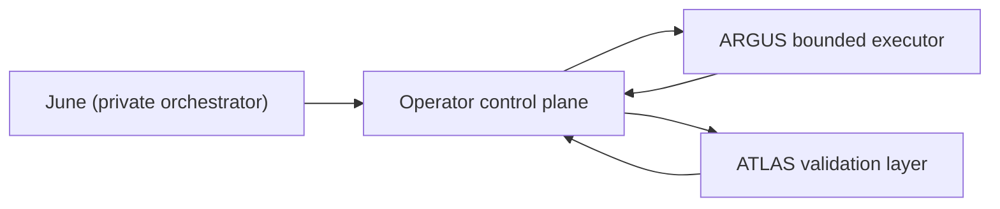

# operator-control-plane

[](LICENSE)
[](docs/README.md)
[](docs/STACK_SETUP.md)

`operator-control-plane` is the Operator repository of a research/control-plane
system. Operator owns project truth, research state transitions,
control-plane events, experiment-lane state, and the durable artifacts that
the higher-level mission layer consumes.

This repo is intentionally opinionated:

- June is the only global orchestrator.
- Operator is the only epistemic source of truth.
- The experiment lane is bounded and subordinate to Operator.
- Argus and Atlas are bounded execution/validation layers, not peer planners.

## What This Repo Contains

- research workflows and phase orchestration
- project/job state machinery
- control-plane intake, events, and contracts
- bounded experiment execution and ingestion
- a Next.js UI for inspecting and triggering Operator state
- architecture docs and tests

## System Shape



## Public Status

This is an open-source release of an actively evolving system. Expect real code
and real tests, but also expect architecture docs, deployment assumptions, and
subsystem boundaries to keep evolving.

## Reading Order

- [docs/README.md](docs/README.md)
- [docs/ARCHITECTURE.md](docs/ARCHITECTURE.md)
- [docs/STACK_SETUP.md](docs/STACK_SETUP.md)
- [docs/CONTROL_PLANE_SPEC.md](docs/CONTROL_PLANE_SPEC.md)
- [docs/EXPERIMENT_LANE_CONTRACT.md](docs/EXPERIMENT_LANE_CONTRACT.md)

## Repository Layout

- `workflows/`: shell-driven research execution primitives
- `tools/`: Python helpers, contracts, intake, and ingestion logic
- `lib/`: brain/memory/plumber libraries
- `ui/`: Next.js dashboard and API routes
- `docs/`: canonical architecture and operating docs
- `tests/`: Python, shell, integration, and UI coverage

## Quickstart

### Backend

```bash
python3 -m venv .venv
source .venv/bin/activate
pip install -r requirements-research.txt -r requirements-test.txt
```

### UI

```bash
cd ui
npm install
cp .env.local.example .env.local
```

Set these values before logging in:

- `OPERATOR_ROOT`
- `UI_PASSWORD_HASH`
- `UI_SESSION_SECRET`

### Validation

```bash
python3 -m py_compile tools/*.py
./.venv/bin/pytest -q
cd ui && npm test
```

If `pnpm` is available, `pnpm test` from `ui/` is equivalent to the repo-local
Vitest command above.

## Related Repositories

This repo is one part of a larger system. Public consumers should treat it as
the Operator truth/control-plane layer rather than a complete standalone agent
stack.

- [argus-bounded-executor](https://github.com/Mickdownunder/argus-bounded-executor)
- [atlas-validation-layer](https://github.com/Mickdownunder/atlas-validation-layer)

For cross-repo wiring, see [docs/STACK_SETUP.md](docs/STACK_SETUP.md).
