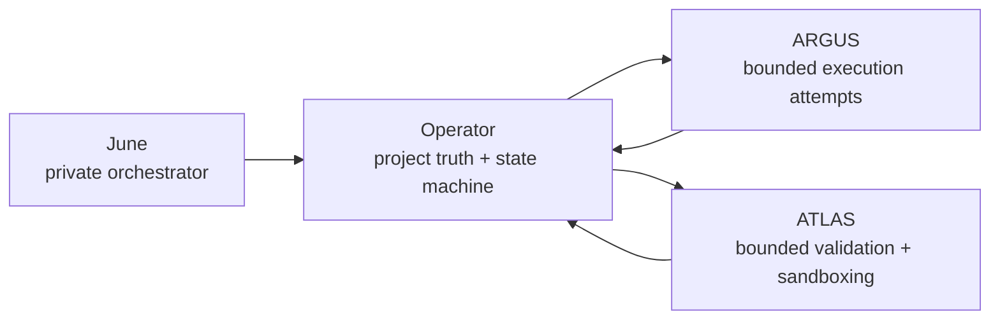

# operator-control-plane

<p>
  Stateful control plane for long-running AI research. Operator owns canonical
  project truth, phase transitions, evidence state, and validation gates.
</p>

<p>
  <a href="https://github.com/Mickdownunder/operator-control-plane/actions/workflows/quality-gates.yml"></a>
  <a href="https://github.com/Mickdownunder/operator-control-plane/blob/main/LICENSE"></a>
  <a href="https://github.com/Mickdownunder/operator-control-plane/releases"></a>
</p>

## What This Repo Is

`operator-control-plane` is the authoritative state layer in the public
`operator + argus + atlas` stack.

- Questions become durable projects (`research/<project_id>/project.json`).
- Research runs through explicit phases with contract-driven transitions.
- Validation can block, loop back, or deepen work before synthesis.
- UI and automation read/write canonical state, not ad-hoc job output.

## Ownership Boundaries

Operator owns:

- project truth and lifecycle phase/status
- evidence and validation state
- control-plane events derived from machine state
- ingestion of bounded worker outputs (ARGUS/ATLAS)

Operator does not own:

- private top-level mission orchestration policy
- global intake strategy outside this public control-plane surface
- unconstrained worker-side execution logic

## Architecture Summary



## Quickstart

Prerequisites:

- Python `3.11+`
- Node.js `20+`
- `npm` (or `pnpm` for UI test workflow parity)

### 1) Backend setup

```bash
cd /path/to/operator-control-plane
python3 -m venv .venv
source .venv/bin/activate
pip install -r requirements-research.txt -r requirements-test.txt
```

### 2) UI setup

```bash
cd ui
npm ci
cp .env.local.example .env.local
```

Set required values before login:

- `OPERATOR_ROOT`
- `UI_PASSWORD_HASH`
- `UI_SESSION_SECRET`

Optional auth hardening:

- `UI_LOGIN_MAX_ATTEMPTS`
- `UI_LOGIN_WINDOW_SECONDS`
- `UI_LOGIN_LOCK_SECONDS`

### 3) Validate and run

```bash
python3 -m py_compile tools/*.py
./.venv/bin/pytest -q
cd ui && npm test
```

Start UI:

```bash
cd ui
npm run dev
```

## Repository Layout

- `workflows/`: research-cycle entrypoints and phase execution
- `tools/`: contracts, ingestion, state helpers, and research tooling
- `lib/`: memory, brain, and supporting libraries
- `ui/`: Next.js dashboard and API routes
- `docs/`: architecture, setup, contracts, and operations
- `tests/`: Python, shell, integration, and UI coverage

## Documentation Map

- [docs/README.md](docs/README.md) - docs index and reading path
- [docs/ARCHITECTURE.md](docs/ARCHITECTURE.md) - system architecture
- [docs/ARCHITECTURE_INVARIANTS.md](docs/ARCHITECTURE_INVARIANTS.md) - non-negotiable architecture rules
- [docs/CONTROL_PLANE_SPEC.md](docs/CONTROL_PLANE_SPEC.md) - control-plane contract
- [docs/EXPERIMENT_LANE_CONTRACT.md](docs/EXPERIMENT_LANE_CONTRACT.md) - experiment lane schema
- [docs/STACK_SETUP.md](docs/STACK_SETUP.md) - multi-repo wiring
- [docs/DEMO.md](docs/DEMO.md) - 2-5 minute bounded public demo path
- [docs/LOCAL_RUN.md](docs/LOCAL_RUN.md) - local operation
- [docs/DEPLOY.md](docs/DEPLOY.md) - server deployment
- [docs/CONTRIBUTOR_MAP.md](docs/CONTRIBUTOR_MAP.md) - high-signal contributor entry points

## Project Quality Surface

- [CONTRIBUTING.md](CONTRIBUTING.md)
- [SECURITY.md](SECURITY.md)
- [CODE_OF_CONDUCT.md](CODE_OF_CONDUCT.md)

## Related Repositories

Operator is the state and truth layer. Pair it with:

- [argus-bounded-executor](https://github.com/Mickdownunder/argus-bounded-executor)
- [atlas-validation-layer](https://github.com/Mickdownunder/atlas-validation-layer)

For full stack setup, see [docs/STACK_SETUP.md](docs/STACK_SETUP.md).
