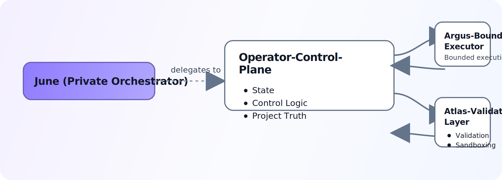

# operator-control-plane

<p>
  Stateful control plane for long-running AI research. Operator owns canonical
  project truth, phase transitions, evidence state, and validation gates.
</p>

<p>
  <a href="https://github.com/Mickdownunder/operator-control-plane/actions/workflows/quality-gates.yml"></a>
  <a href="https://github.com/Mickdownunder/operator-control-plane/blob/main/LICENSE"></a>
  <a href="https://github.com/Mickdownunder/operator-control-plane/releases"></a>
</p>

## What This Repo Is

`operator-control-plane` is the authoritative state layer in the public
`operator + argus + atlas` stack.

- Questions become durable projects (`research/<project_id>/project.json`).
- Research runs through explicit phases with contract-driven transitions.
- Validation can block, loop back, or deepen work before synthesis.
- UI and automation read/write canonical state, not ad-hoc job output.

## Ownership Boundaries

Operator owns:

- project truth and lifecycle phase/status
- evidence and validation state
- control-plane events derived from machine state
- ingestion of bounded worker outputs (ARGUS/ATLAS)

Operator does not own:

- private top-level mission orchestration policy
- global intake strategy outside this public control-plane surface
- unconstrained worker-side execution logic

## Architecture Summary

<<<<<<< HEAD

=======
It owns:

- project truth
- evidence state
- research status
- control-plane events derived from state
- experiment-lane ingestion
- the multi-phase lifecycle from first question to validated report

It does not own:

- global mission intake
- higher-level private orchestration policy
- execution-local artifacts from bounded workers

## Research Lifecycle

Operator runs long-lived research through explicit phases:

| Phase | Purpose |
| --- | --- |
| `explore` | Open the search space and gather initial evidence |
| `focus` | Narrow onto the strongest unresolved lines |
| `connect` | Cross-reference findings and build structure |
| `verify` | Apply evidence gates, fact checks, and loop-back decisions |
| `synthesize` | Generate the report from validated project state |

This is why the system behaves differently from a one-shot agent demo:
it can advance, stall, loop back, deepen, or stop based on state and evidence.

## Architecture


## What Makes It Interesting

### 1. Truth ownership is explicit

`research/<project_id>/project.json` is canonical project truth.
Workers can produce bounded artifacts, but they do not get to silently replace
or compete with the project state.

### 2. Validation is structural

Verification is not an optional polish step after generation.
Evidence gates and verification artifacts are part of the lifecycle itself.

### 3. Execution is separated from sovereignty

ARGUS can execute aggressively.
ATLAS can challenge results.
Neither becomes the truth layer.

### 4. The system keeps memory and state

Operator persists findings, principles, project metrics, progress, reports, and
control-plane events across runs instead of treating each run as stateless.

## Models And Retrieval Stack

The system does not force one model across the entire loop.
Different parts of the pipeline are routed through different lanes based on
depth, verification needs, and cost.

### Model lanes

- verification routes across `gemini-3.1-pro-preview`,
  `gemini-2.5-flash`, and `gpt-4.1-mini`
- synthesis and critique use stronger reasoning lanes such as `gpt-5.4`, with
  cheaper fallbacks when appropriate
- reasoning and extraction default to lighter models such as `gpt-4.1-mini`
- cross-project memory indexing uses `text-embedding-3-small`

### Retrieval surface

Research input comes from multiple source classes:

- web search via Brave Search or Serper
- academic literature via Semantic Scholar and arXiv
- biomedical literature via PubMed
- structured company evidence via SEC EDGAR
- content retrieval via direct fetch, Jina Reader, Google cache fallback,
  Wayback fallback, and PDF extraction

This gives the stack a wider evidence surface than a single search adapter or a
single-model RAG loop.

## Cost Profile

Spend is tracked per project across:

- LLM usage
- search APIs
- embeddings

Smaller runs often land in the tens of cents, while deeper multi-phase runs
cost more depending on search breadth, selected model lanes, and validation
depth.

In my own lightweight runs, a typical cycle often lands around `$0.35`, but the
system does not pretend that this is fixed. Budget checks are built into the
research loop and can stop projects before spend runs away.

## Repository Layout

- `workflows/`: research-cycle entrypoints and phase execution
- `tools/`: contracts, ingestion, state helpers, and research tooling
- `lib/`: memory, brain, and supporting libraries
- `ui/`: Next.js dashboard and API routes
- `docs/`: architecture, setup, and contract documents
- `tests/`: Python, shell, integration, and UI coverage

## Reading Order

- [docs/README.md](docs/README.md)
- [docs/ARCHITECTURE.md](docs/ARCHITECTURE.md)
- [docs/CONTROL_PLANE_SPEC.md](docs/CONTROL_PLANE_SPEC.md)
- [docs/EXPERIMENT_LANE_CONTRACT.md](docs/EXPERIMENT_LANE_CONTRACT.md)
- [docs/STACK_SETUP.md](docs/STACK_SETUP.md)
>>>>>>> 8612aab (fix(ci): stabilize python gate and readme diagram)

## Quickstart

Prerequisites:

- Python `3.11+`
- Node.js `20+`
- `npm` (or `pnpm` for UI test workflow parity)

### 1) Backend setup

```bash
cd /path/to/operator-control-plane
python3 -m venv .venv
source .venv/bin/activate
pip install -r requirements-research.txt -r requirements-test.txt
```

### 2) UI setup

```bash
cd ui
npm ci
cp .env.local.example .env.local
```

Set required values before login:

- `OPERATOR_ROOT`
- `UI_PASSWORD_HASH`
- `UI_SESSION_SECRET`

Optional auth hardening:

- `UI_LOGIN_MAX_ATTEMPTS`
- `UI_LOGIN_WINDOW_SECONDS`
- `UI_LOGIN_LOCK_SECONDS`

### 3) Validate and run

```bash
python3 -m py_compile tools/*.py
./.venv/bin/pytest -q
cd ui && npm test
```

Start UI:

```bash
cd ui
npm run dev
```

## Repository Layout

- `workflows/`: research-cycle entrypoints and phase execution
- `tools/`: contracts, ingestion, state helpers, and research tooling
- `lib/`: memory, brain, and supporting libraries
- `ui/`: Next.js dashboard and API routes
- `docs/`: architecture, setup, contracts, and operations
- `tests/`: Python, shell, integration, and UI coverage

## Documentation Map

- [docs/README.md](docs/README.md) - docs index and reading path
- [docs/ARCHITECTURE.md](docs/ARCHITECTURE.md) - system architecture
- [docs/ARCHITECTURE_INVARIANTS.md](docs/ARCHITECTURE_INVARIANTS.md) - non-negotiable architecture rules
- [docs/CONTROL_PLANE_SPEC.md](docs/CONTROL_PLANE_SPEC.md) - control-plane contract
- [docs/EXPERIMENT_LANE_CONTRACT.md](docs/EXPERIMENT_LANE_CONTRACT.md) - experiment lane schema
- [docs/STACK_SETUP.md](docs/STACK_SETUP.md) - multi-repo wiring
- [docs/DEMO.md](docs/DEMO.md) - 2-5 minute bounded public demo path
- [docs/LOCAL_RUN.md](docs/LOCAL_RUN.md) - local operation
- [docs/DEPLOY.md](docs/DEPLOY.md) - server deployment
- [docs/CONTRIBUTOR_MAP.md](docs/CONTRIBUTOR_MAP.md) - high-signal contributor entry points

## Project Quality Surface

- [CONTRIBUTING.md](CONTRIBUTING.md)
- [SECURITY.md](SECURITY.md)
- [CODE_OF_CONDUCT.md](CODE_OF_CONDUCT.md)

## Related Repositories

Operator is the state and truth layer. Pair it with:

- [argus-bounded-executor](https://github.com/Mickdownunder/argus-bounded-executor)
- [atlas-validation-layer](https://github.com/Mickdownunder/atlas-validation-layer)

For full stack setup, see [docs/STACK_SETUP.md](docs/STACK_SETUP.md).
